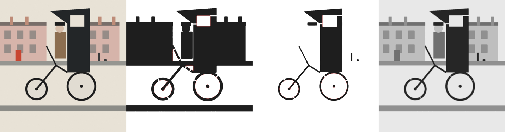

# artstencils

A method, and a small tool, for recreating L.S. Lowry paintings as multi-layer
laser-cut stencils sprayed with an airbrush, with colour added by hand and a
contemporary twist dropped in as its own stencil layer.

The worked example throughout is *The Contraption* (1949): the man in the
bowler hat pedalling a black hansom-cab-on-a-tricycle past pink terraces.
The plan for that specific piece is in [docs/the-contraption-plan.md](docs/the-contraption-plan.md).

```
tools/stencilgen.py   image -> cleaned, bridged, registered SVGs per layer + previews
docs/method.md        the full workflow: image prep, cutting, registration, spraying, hand colour
docs/the-contraption-plan.md   layer-by-layer plan for this painting and the Just Eat twist
examples/             synthetic test scene so you can try the tool without a source image
```

## Why Lowry suits stencils

Lowry painted in flat, matte tones with black outlines, on an off-white ground,
using only five colours (flake white, ivory black, vermilion, Prussian blue,
yellow ochre). That is already a stencil separation. A tonal split into a
ground plus three or four grey layers and a black key layer gets most of the
way, and the small colour notes (a red door, an ochre coat) are quicker and
more Lowry-like brushed on by hand than cut as stencils.

## Quick start

```bash
pip install -r requirements.txt
# put your scan/photo in input/ (git-ignored: the paintings are still in copyright)
python3 tools/stencilgen.py input/contraption.jpg -o out --layers 4 --width-mm 280
```

Output in `out/`:

| file | what it is |
|---|---|
| `layer01_tone1.svg` … `layer04_tone4.svg` | one cut file per layer, mm units, sprayed in numeric order |
| `layerNN_*.png` | preview of each stencil (black = cut away, red outline = island that was bridged) |
| `preview_composite.png` | what the sprayed result should look like before hand colour |
| `report.json` | cut-region counts, islands bridged, paint tone per layer, thresholds |

Every SVG has the same sheet size and the same four blue registration marks,
so cut all of them from the same sheet size and they line up on the board.
Red is cut, blue is cut on every layer, green is the sheet outline, grey dashed
is the image area, black text is the layer label (engrave it or delete it).

Colour mode makes one stencil per quantised colour instead of cumulative greys:

```bash
python3 tools/stencilgen.py input/contraption.jpg -o out_colour --mode colour --layers 6
```

## What the tool does

1. resizes to your physical width at 8 px/mm
2. k-means splits the luminance into N+1 tones. The lightest is the painted
   ground. Layer 1 is everything darker than the ground, layer N is only the
   darkest tone, so each layer overpaints the last and you spray light to dark
3. cleans every mask: nothing thinner than `--min-feature-mm` survives, in the
   cut or in the sheet, and specks under `--min-area-mm2` are dropped
4. finds islands (sheet completely surrounded by cut-out, like the white
   window in the black cab, or the white wheel discs inside black rims) and
   joins each one to the mainland with `--bridges-per-island` bridges of
   `--bridge-mm` width. Islands are processed nearest-first, so chains work
5. traces to SVG paths and adds registration marks

Example on the synthetic scene in `examples/` (source, light-grey layer, black key layer, composite):



Useful flags: `--max-height-mm` to fit a sheet, `--margin-mm` for the border,
`--kerf-mm` if your tests show the cut growing, `--blur-mm` to kill canvas
texture before splitting, `--seed` to get a different split.

## The method in one paragraph

Prime the board with Lowry's off-white ground. Generate the layers, open the
SVGs in Inkscape or LightBurn, tidy bridges, cut them from 190 to 250 micron
Mylar. Pin a registration jig to the board. Spray layer 1 (light grey) through
layer N (black) with an airbrush at low pressure and thin acrylic, using
repositionable adhesive on the back of each stencil. Brush in the colour notes
by hand from the five-colour palette. Cut the contemporary twist (the Just Eat
logo, courier bag, phone) as one more stencil and spray it last. Details in
[docs/method.md](docs/method.md).
